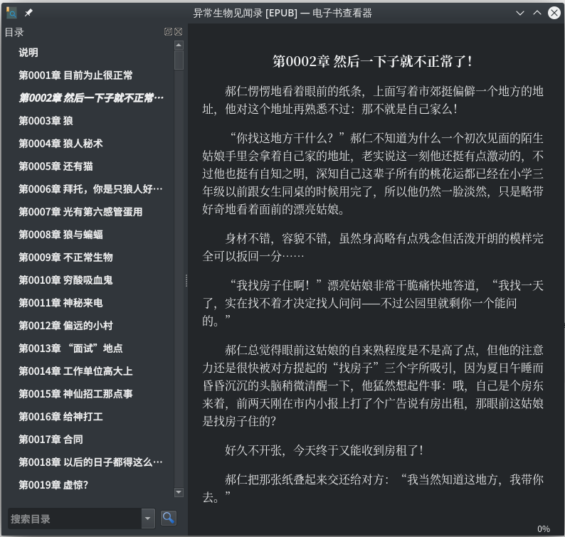

## kaf-cli

> 把txt文本转成epub电子书的命令行工具

### 功能
- 傻瓜操作模式(把txt文件拖到`kaf-cli.exe`上面自动转换)
- 自动识别书名和章节(示例中所有用法都会自动识别)
- 自动识别字符编码(自动解决中文乱码)
- 自定义章节匹配
- 自动给章节正文生成加粗居中的标题
- 段落自动识别
- 段落自动缩进
- 超快速(130章/s以上速度, 4000章30s不到)
- 自动转为mobi格式

### 使用方法
1. [点击下载](https://github.com/ystyle/kaf-cli/releases/latest)
   - [百度网盘 `https://pan.baidu.com/s/1EPkLJ7WIJYdYtRHBEMqw0w`](https://pan.baidu.com/s/1EPkLJ7WIJYdYtRHBEMqw0w) 提取码：`h4np`
     - 网盘有安卓APP版本
   - Archlinux: 在aur上安装 `yay -S kaf-cli`
1. 解压, 把小说直接拖到 `kaf-cli.exe` 文件上面
1. 等转换完，目录下会生成epub和mobi文件


### 效果


### 命令行模式

全部参数为：
```shell
Usage of kaf-cli.exe:
  -author string
        作者 (default "YSTYLE")
  -bookname string
        书名: 默认为txt文件名
  -filename string
        txt 文件名
  -lang string
        设置语言: en,de,fr,it,es,zh,ja,pt,ru,nl (default "zh") 。 支持使用环境变量KAF-CLI-LANG设置
  -match string
        匹配标题的正则表达式, 不写可以自动识别, 如果没生成章节就参考教程。例: -match 第.{1,8}章 表示第和章字之间可以有1-8个任意文字 (default "自动匹配,可自定义")
  -max uint
        标题最大字数 (default 35)
  -tips
        添加本软件教程 (default true)

```

把`全职法师.txt`生成epub, 并设置作者名为`乱`
```shell
cd d:/
d:/kaf-cli.exe -author 乱 -filename d:/全职法师.txt
```


>以下全部示例都可以自动识别，不需要自己设定标题格式了， 一般用上用上面的例子就行了

>要自定义标题格式参考以下几个例子


自定义章节匹配, 章节格式为`第x节`: 
```shell
cd d:/
d:/kaf-cli.exe -filename d:/ebbok.txt -match "第.{1,8}节"
```

自定义章节匹配, 章节格式为`Section 1` ~ `Section 100`: 
```shell
cd d:/
d:/kaf-cli.exe -filename d:/ebbok.txt -match "Section \d+"
```

自定义章节匹配, 章节格式为`Chapter xxx`: 
```shell
cd d:/
d:/kaf-cli.exe -filename d:/ebbok.txt -match "Chapter .{1,8}"
```


### 在任意位置执行命令

- 把`kaf-cli.exe` 和 `kindlegen.exe` 放`c:/windows/`下边
- 以后可以把小说放任意目录，都可以很简单执行转换， 第一步只需要做一次， 以下为每次转换小说的操作，
  - 打开小说在的文件夹, 按住`Shift键`不放，鼠标右击文件夹空白位置
  - 在右键菜单选择 `用命令行打开` 或 `以PowerShell打开`
  - 以上命令可以改为 `kaf-cli.exe -filename 全职法师.txt`,  现在可以不用写盘符了

### 手动把书转为kindle的mobi格式
>新版如果检测到有kindlegen程序时会自动转为mobi

1. 在官网下载[kindlegen](https://www.amazon.com/gp/feature.html?ie=UTF8&docId=1000765211)
2. 同样放到`d:`盘根目录下， 执行以下命令转换
  ```shell
  cd d:/
  d:/kindlegen.exe d:/全职法师.epub
  ```
3. 在d盘就能找到mobi文件了，复制到kindle的documents目录下，打开kindle就能看到小说了

